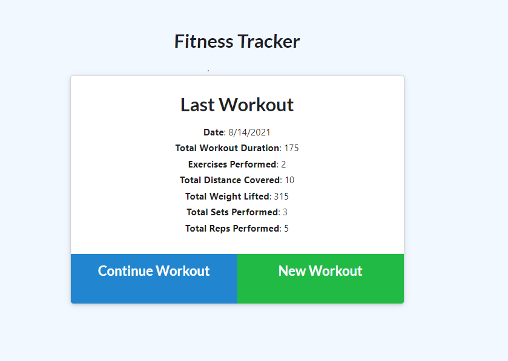
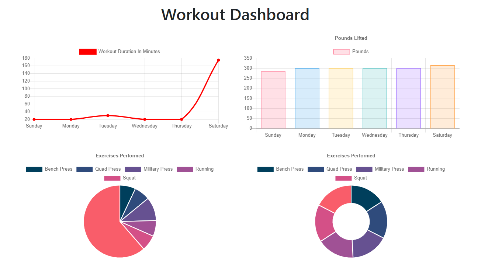

# Fitness Tracker

Increase the effects of your fitness program by recording your workouts and seeing your progress in the past seven days.

## Table of contents
* [Description](#description)
* [Installation](#installation)
* [Usage and links](#usage)
* [License](#license)
* [Contributors](#contributors)
* [Tests](#tests)
* [Questions](#questions)

## Description

Home screen: Record a new workout, or continue a previous workout.

Dashboard: See graphics for amount of pounds lifted and distance ran.  See a pie chart for exercises performed.

Screenshots:

<h4> Home Screen </h4>

<h4> Charts (the Dashboard) </h4>

Features to be added in the future: Increased history range for charts, body weight recording

## Installation

NPM packages required (`npm i` to install all the packages):

Packages used:
<ul>
<li><a href="https://www.npmjs.com/package/express">Express</a></li>
<li><a href="https://www.npmjs.com/package/mongoose">Mongoose</a></li>
<li><a href="https://www.npmjs.com/package/morgan">Morgan</a></li>
</ul>

Optional: 
[nodemon](https://www.npmjs.com/package/nodemon)

Feel free to use the seed data in `seeders` folder

Run `node server.js` to start the server.  

## Usage

<h4> A video demonstration </h4>

Continue workout button: Add an exercise to a previously existing workout (displayed on the home screen as Last Workout)

New workout button: Add a new workout and exercises for that day.

Dashboard: Display graphs and charts based off the previous seven days of working out.

Deployed application: [click here.](#)

Github repository: [click here.](https://github.com/NguyenJohnnyT/fitness-tracker)

## License

This application is licensed under [MIT]((https://opensource.org/licenses/MIT)).

## Contributors

Anyone can contribute to this project.

## Tests

No tests available.

## Questions
Have a question? Please email me at johnnytrucnguyen@gmail.com

[My Github](https://www.github.com/nguyenjohnnyt)